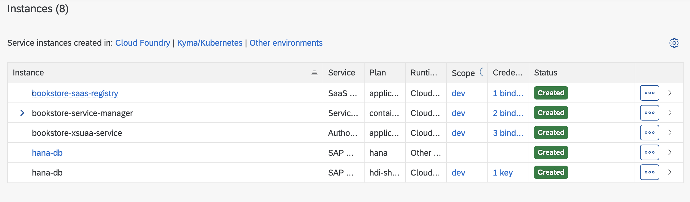

# Springboot CAP ODATA project

### Prerequisites
 * You have an SAP BTP Trial account [Get a Free Account on SAP BTP Trial](https://developers.sap.com/tutorials/hcp-create-trial-account.html)
 * Java 17 
 * Node v20.5.0 or higher
 * Subscribe to Haha Cloud services, tools plan, then create new instance of Hana DB, more info in tutorial:  https://developers.sap.com/tutorials/hana-cloud-mission-trial-2.html

### Tutorials used for creating an application in the Cloud Foundry Environment:

* [Build a Business Application Using CAP for Java](https://developers.sap.com/mission.cap-java-app.html)
* [CAPire official documentation](https://cap.cloud.sap/docs/get-started/jumpstart)
* [Start Using SAP HANA Cloud Trial in SAP BTP Cockpit](https://developers.sap.com/tutorials/hana-cloud-mission-trial-2.html)
* [Multitenant application using Cloud Application Programming Model (CAP)](https://blogs.sap.com/2021/05/19/multitenant-application-using-cloud-application-programming-model-cap/)

### Useful commands

Get space guid

```
cf space <space_name> --guid
```

Create application skeleton:

```
mvn -B archetype:generate -DarchetypeArtifactId=cds-services-archetype -DarchetypeGroupId=com.sap.cds \
-DarchetypeVersion=RELEASE -DjdkVersion=17 \
-DgroupId=com.sap.cap -DartifactId=products-service -Dpackage=com.sap.cap.productsservice
```

Generate mta file for project:

```
cds add mta
```
Terminal hotkeys:

clean word: `Command` + `Control` + `W`\
Delete the line: `Command` + `Control` + `U`

## Multitenancy with Cloud Application Programming Model (CAP) 
To enable multitenancy on the SAP BTP, we need to deploy tenant aware approuter, mtx-sidecar module and configure below three services.

Only when these services are bound to your application, the multitenancy feature is turned on.

1. XSUAA
2. Service Manager
3. SaaS Provisioning service (saas-registry)

#### Approuter module:
   You deploy the approuter application as a Cloud Foundry application and as a logical part of the multitenant application. Then you configure approuter application as an external access point of the application.
Each multitenant application has to deploy its own application router and the application router handles requests of all tenants to the application.
The application router must determine the tenant-specific subdomain. This determination is done by using a regular expression defined in the environment variable TENANT_HOST_PATTERN. 
   The application router then forwards the authentication request to the tenant User Account and Authentication (UAA) service and the related identity zone.


#### XS UAA:
Bind your multitenant application and the approuter application to the SAP Authorization and Trust Management service (technical name: xsuaa) instance, which acts as an OAuth 2.0 client to your application.

In multi-tenant environments, tenants subscribe to and consume applications, which are registered as clients at the XS UAA. XS UAA creates a new OAuth2 client per application for each tenant. 
The shared tenant mode is mandatory for an application router configured for multi-tenancy applications.
Also, a special configuration of an XS UAA service instance is required to enable authorization between the SaaS Provisioning service, Cloud Application Programming Model Java application, and MTX sidecar.

#### Service Manager:
A service-manager instance is required that the Cloud Application Programming Model Java SDK can create database containers per tenant at application runtime. 
It doesn’t require special parameters and can be added as a resource in mta.yaml.

#### SaaS Provisioning Service (saas-registry):
A saas-registry service instance is required to make your application known to the SAP BTP Provisioning service and to register the endpoints that should be called when tenants are added or removed. 
The service can be configured as a resource in mta.yaml

#### mtx-sidecar module:
Cloud Application Programming Model provides the npm module for Node.js. It provides APIs for implementing SaaS applications on SAP BTP.
Java applications need to run and maintain the cds-mtx module as a sidecar application.
Multitenant Cloud Application Programming Model Java applications automatically expose the tenant provisioning APIs.

provisioning: implements the subscription callback API as required by SAP BTP. 
If a tenant is subscribing to the SaaS application, the onboarding request is handled. cds-mtx is contacting the SAP HANA Service Manager service to create a new HDI container for the tenant. 
Then, database artifacts get deployed into this HDI container.
In addition, the unsubscribe operation and the “get dependencies” operations are supported.

### How to configure multitenancy support

1. Add xsuaa and approuter to your project:  run `cds add approuter`. \
   This will create `app` directory in your project root with approuter application and `xs-security.json` file with
   configuration for auth,\
   also in `.cdsrc.json` will be added xsuaa configuration, the whole json will look like this:

```json
{
  "build": {
    "target": "."
  },
  "hana": {
    "deploy-format": "hdbtable"
  },
  "requires": {
    "auth": "xsuaa"
  }
}
```

2. Add `mtx sidecar` node.js module to your project and update your `.cdsrc.json`: run `cds add multitenancy`. \
   mtx directory will be added to the project's root, your `.cdsrc.json` will be updated with some configurations for
   multitenancy and will look like this:

```json
{
  "build": {
    "target": "."
  },
  "hana": {
    "deploy-format": "hdbtable"
  },
  "requires": {
    "auth": "xsuaa",
    "multitenancy": true
  },
  "profiles": [
    "with-mtx-sidecar",
    "java"
  ]
}
```

`xs-security` file will be also updated and will look like:

```json
{
  "scopes": [
    {
      "name": "$XSAPPNAME.mtcallback",
      "description": "Subscription via SaaS Registry",
      "grant-as-authority-to-apps": [
        "$XSAPPNAME(application,sap-provisioning,tenant-onboarding)"
      ]
    }
  ],
  "attributes": [],
  "role-templates": []
}
```

3. Now we need to generate `mta.yaml` deployment file that will include all previously configured modules,
   run `cds add mta`
4. In the generated `mta.yaml` we need to modify several modules:
- In module xsuaa add `oauth2-configuration` for redirect uris and add `dependency to your approuter`, xsuaa module should look like this:
```yaml
  - name: bookstore-xsuaa-service
    type: org.cloudfoundry.managed-service
    parameters:
      service: xsuaa
      service-plan: application
      path: ./xs-security.json
      config:
        xsappname: bookstore-${org}-${space}
        tenant-mode: shared
        oauth2-configuration:
          redirect-uris:
            - https://*.~{approuter-app-api/domain}/**
    requires:
      - name: approuter-app-api
```      
- In `MTX` module delete dependency for `approuter` in `requires` section
```yaml
#this part should be deleted:
      - name: approuter-api
        properties:
          SUBSCRIPTION_URL: ~{app-protocol}://\${tenant_subdomain}-~{app-uri}
```
- In `Approuter` module add `domain` in `provides` section :
```yaml
    provides:
      - name: approuter-app-api
        properties:
          url: ${default-url}
#This line should be added:          
          domain: ${domain}
```

#### Troubleshooting:
If during running command `mbt build` such error thrown `ERROR could not build the "bookstore-mtx-app" module: could not execute the "npm run build" command: exit status 1`
then in mtx/sidecar directory update your package.json, in sript section replace build line with following build:
```json
 "build": "cds build ../.. --for mtx-sidecar --production && cd gen && npm install"
```

### Deploy Multitenant Application:

- Run `mbt build`
- Run `cf login`
- Run `cf deploy mta_archives/bookstore_1.0.0-SNAPSHOT.mtar`
- Go to another subaccount in your global account, under subscriptions and subscribe to the application you deployed.
- Run `cf map-route bookstore-approuter <YOUR DOMAIN> --hostname <SUBSCRIBER TENANT>-<ORG>-<SPACE>-bookstore-approuter`
  or create and bind the route manually.\
  Example: `cf map-route bookstore-approuter cfapps.us10-001.hana.ondemand.com --hostname tenant2-wm0m8hbo-c3fbaed9trial-dev-bookstore-approuter`

### Adding roles for SAAS Registry Dashboard


If you try to access SAAS Registry Dashboard by clicking the link of running saas-registry instance you will see the page saying `You are not authorized to access the Subscription Management Dashboard.`

To get access you wil need to set up a role collection:

1. Go to the Security
2. Go to Role Collection 
3. Add a new Role Collection by clicking + button, call it whatever you want and hit create
4. Scroll down and click edit that new role collection and hit edit
5. Add two roles `Subscription Management Dashboard Administrator` and `Subscription Management Dashboard Viewer`
6. In Users tab add your email address

Recourses: https://www.youtube.com/watch?v=W49RRIPJxfo&t=256s&ab_channel=SAPHANAAcademy

### Adding roles for managing instances in HANA Cloud

1. To ensure that your desired user has the necessary permissions to manage instances in HANA Cloud Central, navigate to **Security
   -> Users** in the left hand side menu. Then click on your user.
2. Click on the **three dots** in the right-hand panel to find the **Assign Role Collection** button.
3. Select **SAP HANA Cloud Administrator** then click Assign Role Collection.

Recourses: https://developers.sap.com/tutorials/hana-cloud-mission-trial-2.html

